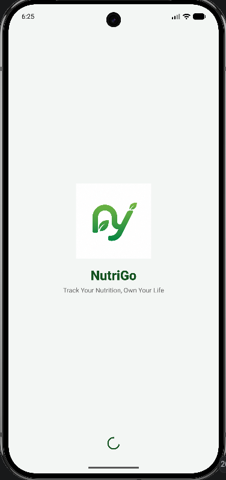
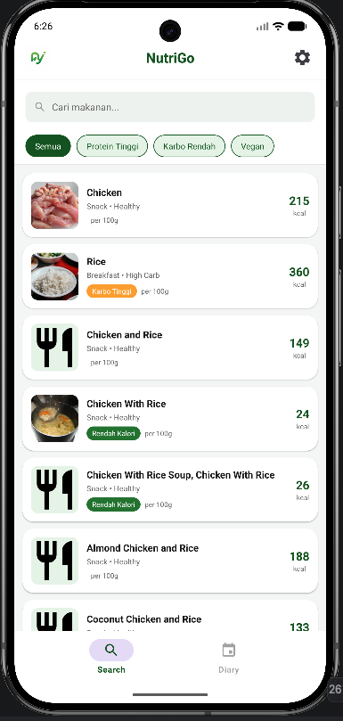
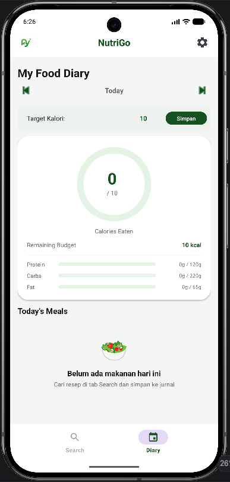
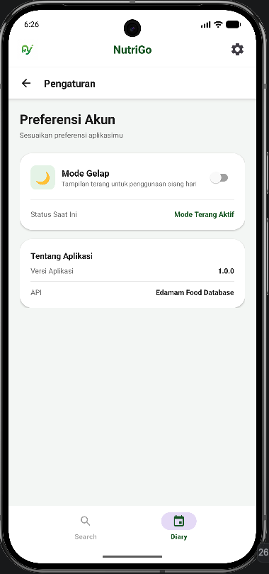

# 🍏 NutriGo

**NutriGo** adalah aplikasi Android yang membantu pengguna memantau asupan nutrisi harian, mencari informasi gizi makanan secara *real-time*, serta mencatat jurnal makanan dengan mudah dan intuitif. Aplikasi ini dibuat sebagai pemenuhan **Tugas Final Praktikum Pemrograman Mobile**.

---

## 🌟 Fitur Utama
1. **Pencarian Makanan**: Cari ribuan data makanan beserta informasi gizinya secara *real-time* menggunakan Edamam API.
2. **Jurnal Makanan Harian**: Catat konsumsi makanan (Breakfast, Lunch, Dinner, Snack) dan pantau target kalori harian.
3. **Detail Nutrisi Lengkap**: Menampilkan rincian kalori, protein, karbohidrat, lemak, serta mikronutrisi.
4. **Dukungan Offline**: Data jurnal disimpan secara lokal sehingga tetap dapat diakses tanpa koneksi internet.
5. **Tema Ganda**: Mendukung mode terang (Light Mode) dan mode gelap (Dark Mode).

---

## 🛠️ Implementasi Teknis Singkat
Aplikasi ini diimplementasikan sesuai dengan kriteria spesifikasi teknis tugas final:
* **Activity & Intent**: Menggunakan `MainActivity`, `SplashActivity` sebagai loading awal, dan `DetailActivity` untuk rincian data. Berpindah antar activity menggunakan Explicit Intent.
* **RecyclerView**: Menampilkan daftar makanan hasil pencarian API dan daftar makanan tersimpan di jurnal harian.
* **Fragment & Navigation**: Menggunakan Navigation Component untuk mengelola navigasi tab bawah (`SearchFragment`, `DiaryFragment`, `SettingsFragment`).
* **Background Thread**: Melakukan operasi database Room menggunakan `ExecutorService` dan memproses hasilnya kembali ke UI thread menggunakan `Handler`.
* **Networking**: Mengambil data gizi dari **Edamam Food Database API** menggunakan Retrofit. Terdapat *error handling* dan tombol *Refresh* saat koneksi terputus.
* **Local Data Persistent**: Menggunakan database **Room (SQLite)** untuk menyimpan jurnal makanan dan **SharedPreferences** untuk menyimpan pengaturan tema.

---

## 📸 Dokumentasi Layar Aplikasi

Berikut adalah dokumentasi tampilan antarmuka (UI) dari aplikasi NutriGo:

### 1. Halaman Pemuatan (Splash Screen)
Halaman awal yang muncul (*loading screen*) saat aplikasi pertama kali dibuka sebelum masuk ke menu utama.


### 2. Halaman Beranda / Pencarian (Home)
Fitur utama untuk mencari data gizi dan kalori makanan secara *real-time* dengan berbagai filter (Breakfast, Lunch, Snack).


### 3. Halaman Jurnal Makanan (Diary)
Tempat pengguna melihat rekap makanan yang telah disimpan beserta total kalori harian yang dikonsumsi per tanggal.


### 4. Halaman Pengaturan (Settings)
Halaman pengaturan preferensi pengguna, termasuk fitur untuk mengganti tema aplikasi (Terang/Gelap).


---

## 🚀 Cara Menjalankan Aplikasi
1. *Clone* repositori ini ke komputer lokal Anda:
   ```bash
   git clone https://github.com/nurulmarisa/nutrigo.git
   ```
2. Buka proyek tersebut menggunakan **Android Studio**.
3. Tunggu hingga proses sinkronisasi Gradle selesai.
4. Hubungkan perangkat Android fisik atau jalankan Emulator.
5. Klik tombol **Run (▶)** pada Android Studio untuk menginstal dan menjalankan aplikasi.


